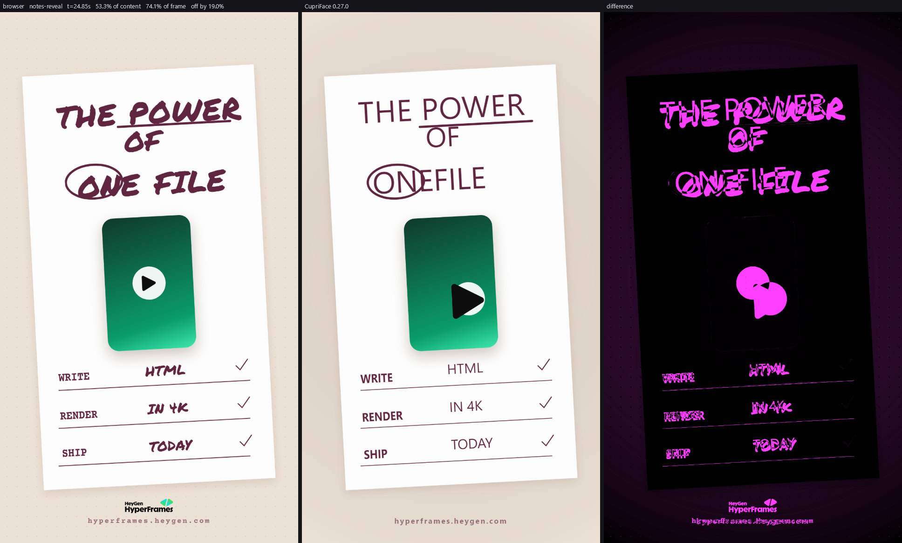
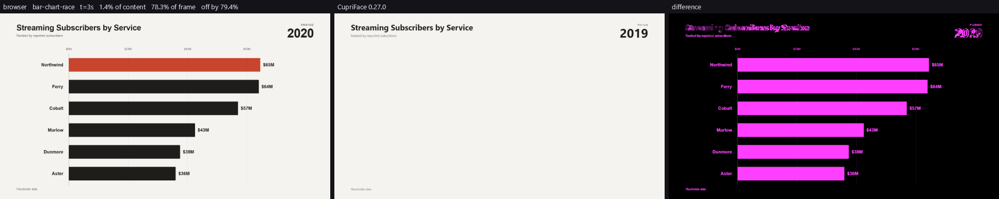

# CupriLex

**Browser HTML in. CupriFace-safe HTML out. A report of everything that could not come with it.**

CupriLex translates compositions written for a browser — specifically
[HyperFrames](https://github.com/heygen-com/hyperframes) blocks — into HTML and CSS that
[CupriFace](https://github.com/Wixely/CupriFace) renders, so that
[CupriCut](https://github.com/Wixely/CupriCut) can turn them into video without a browser anywhere.

**The report matters more than the conversion.** Silently dropping a transition is how somebody
ships a video missing its transitions. Anything this tool cannot carry, it says so, by name, with
the line it was on.

---

## Read this before anything else

The corpus was surveyed before a line of the translator was designed, and it says something the
original plan did not expect.

**All 187 HyperFrames blocks are animated entirely in JavaScript. Not one uses CSS `@keyframes`
or `animation:`.**

| | |
|---|---|
| blocks surveyed | **187** |
| load GSAP | **187 — 100%** |
| have an inline `<script>` | **187 — 100%** |
| use `@keyframes` | **0** |
| use CSS `animation:` | **0** |
| use CSS `transition:` | **0** |

CupriFace has no JavaScript engine, by design. So there is no subset of this corpus that works
without the GSAP compiler — it is not the hard half of the job, it is the *whole* job. Everything
else (tokens, typography, layout) is the easy part that arrives for free once motion is solved.

Reproduce these numbers with `python tools/survey.py` — see [docs/CORPUS.md](docs/CORPUS.md).

---

## What has to happen, in order

1. **Know what the engine supports**, mechanically, per version — `conformance/`. Without this the
   translator is guessing about the target, and the guesses go stale every release. *(done)*
2. **Measure how far off it is**, against a real browser, frame by frame — `harness/`. *(done)*
3. **Compile GSAP timelines to `@keyframes`** for the verbs the corpus actually uses —
   `compiler/`. *(done)*
4. **Rewrite what can be rewritten** and **report what cannot**. *(in progress: three rules exist,
   each because it was blocking a measurement)*

See [PLAN.md](PLAN.md).

---

## Where it stands

A headless browser renders each block seeked to an exact instant; CupriFace renders the same
instant; the frames are compared. One number per block, and the picture that explains it.

```
dotnet run --project harness -- notes-reveal          # one block
dotnet run --project harness -- --all --out review --gallery
```

The second writes `review/index.html`: every block, worst first, with its images. That is the
fastest way to see the current state, and `review/` is ignored.

**A block the compiler carries.** The composition arrives, its SVG draws, its layout holds. What is
missing is the handwritten face, which falls back to a plain one, and the card's rotation.



**A block it refuses.** Every bar, label and gridline here is built by `document.createElement`, and
the timeline that animates them is assembled in a loop over parsed data. There is nothing in the
markup for a JavaScript-free renderer to draw, and the compiler says so rather than guessing.



### The numbers

On CupriFace 0.36.0, over the corpus pinned at
[`c9b3d9c9`](https://github.com/heygen-com/hyperframes/commit/c9b3d9c9628d4c51696147ecd2fd881080e72824)
— see [docs/HARNESS.md](docs/HARNESS.md):

| | |
|---|---|
| blocks scored | **168 of 172** |
| **mean of content** | **44.3%** — the number to beat |
| median | 40.9% |
| mean of frame | 75.8% |
| where it is wrong, off by | 28.5% of full scale |
| blocks that render one still frame | 105 of 168 |
| **blocks the engine paints almost nothing in** | **76 of 168** |

Measured 6 October 2026, with the faces a block links from a font service *not* fetched, so it is
comparable with every number before it. On the same pin, in order:

| | mean of content | what changed |
|---|---|---|
| 0.28.1 | 37.1% | |
| 0.28.1 | 40.3% | two translator workarounds for engine gaps found by dissecting one block |
| 0.34.0 | 43.5% | the engine fixed six of those gaps; both workarounds deleted |
| 0.35.0 | 43.5% | six more gaps fixed, and a tiled-gradient regression that cancelled them |
| **0.36.0** | **44.3%** | the regression fixed, and the older bug under it |

Three engine releases in two days, thirteen issues raised from this repository's measurements and
all thirteen fixed. The last two rows are the mechanism earning its keep: 0.35.0's six fixes moved
the mean by **nothing** because a regression arrived with them, the corpus run said so the same
day, and the fix for it was worth 0.8 points plus everything 0.35.0 had been owed. See
[docs/CONFORMANCE.md](docs/CONFORMANCE.md).

**The commit is part of the number.** The corpus is somebody else's work, fetched rather than
vendored — and it used to be fetched from `main`, so every measurement took whatever upstream
happened to be that day. Two fetches a day apart differed by 24 blocks removed and 9 added, and the
mean fell from 40.8% to 37.1% without a line of this repository changing: the blocks that went were
the dense-text ones scoring 70–99%. It is pinned now, so these numbers can be reproduced and the
next ones can be compared to them. CI asks upstream weekly whether the pin has aged.

That last row is the constraint, and it was not visible until it was measured. Half the corpus
renders under 0.5% of its own frame — the composition is built or painted by the JavaScript that
had to be removed — so those blocks cannot be improved by fidelity work of any kind. Four correct
fixes in a row moved the mean by nothing for this reason: a timeline cursor, an easing parameter, a
WOFF 2 font decoder that changed the pixels of exactly three blocks, and reading start values out
of the stylesheet, which turned 50 stills into animations and left the mean where it was.

The first one that did move it was drawing the images, worth 2.5 points, and it had been
documented as done for weeks while no code did it.

The second came from taking one block apart instead of surveying all of them. `x-post` had its
motion compiled correctly and scored 40%, because the engine ignored a percentage `translate()`
and positioned an absolute child against an unsized parent's own box, so a centred card was drawn
at the top-right corner. Two workarounds were worth 3.2 points and 18 blocks with none worse; the
six engine behaviours the dissection surfaced went upstream as CupriFace #258-#263, were fixed in
0.34.0 within the week, and the workarounds were deleted on the strength of the matrix diff. The
third gain, below, is that engine release. See [docs/HARNESS.md](docs/HARNESS.md), "What
dissecting one block found".

**Read the content number, not the frame number.** They differ by 29 points because these
compositions paint on a small share of a large frame, so counting the empty background rewards a
translation that loses the content. One block scores 98.3% of frame and 0.0% of content. The four
measures and why there are four are set out in [docs/HARNESS.md](docs/HARNESS.md).

The earlier figures in this repository's history — 55.2%, 62.8% — were the frame-wide measure. They
were not wrong, but they flattered, and the content measure replaces them as the headline.

---

## The GSAP surface that actually has to be understood

Counted across the whole corpus, so it is scope rather than speculation:

| call | uses | what it becomes |
|---|---|---|
| `.to()` | 1129 | a `@keyframes` from current state to the target |
| `.set()` | 1045 | a static declaration, or a zero-length step |
| `.fromTo()` | 362 | a `@keyframes` with both ends given |
| `.timeline()` | 216 | the clock everything is placed on |
| `.from()` | 82 | a `@keyframes` to the element's authored state |
| `.add()` | 68 | nesting, and position parameters |
| `.parseEase()` | 52 | a `cubic-bezier()` |
| `.time()` / `.seek()` | 51 | absolute placement |
| `.eventCallback()` / `.call()` | 46 | **not translatable — becomes a CupriCut event** |
| `.addLabel()` | 14 | a named position other tweens are relative to |

Four verbs — `to`, `set`, `fromTo`, `from` — are 2618 of the calls. That is the compiler.

---

## What this is not

- **Not a GSAP implementation.** A bounded subset, compiled ahead of time. Anything outside it is
  refused and named, never approximated.
- **Not a runtime dependency.** A composition is translated **once**, into a `.cutpkg` that is
  already self-contained — one zip with the markup, the assets, the fonts and the report inside.
  A project that has been imported is just a project; nothing depends on this tool at render time.
  See [docs/PACKAGE.md](docs/PACKAGE.md), and [docs/EXTERNAL.md](docs/EXTERNAL.md) for what a
  composition would fetch off the machine and who gets asked.

  The translation is also a library, for a host that wants to do this at run time:
  `CupriLex.Compiler`, alpha, see [docs/PACKAGING.md](docs/PACKAGING.md).

  ```
  dotnet run --project harness -- --all --package out
  ```
- **Not a general HTML-to-CupriFace converter**, though it may become one. The corpus is the
  target, and the corpus is what keeps the scope honest.

---

## Building and testing

```
python tools/fetch-corpus.py                        # the corpus, ~110 MB, not vendored
dotnet build harness -c Release
dotnet run --project tests/CupriLex.Harness.Tests   # the tests
```

The tests are run by **running them**, not with `dotnet test`. They are xunit v3, which is a
self-hosting executable on Microsoft.Testing.Platform, and the .NET 10 SDK still routes
`dotnet test` down the VSTest path and refuses before discovering anything — with both documented
opt-ins in place.

Restoring needs a GitHub Packages credential, because CupriFace is served from there and GitHub
requires authentication even for a public NuGet package. See the comment in
[NuGet.config](NuGet.config).

---

## Licence and attribution

HyperFrames is Apache 2.0, so its blocks and spec text may be used with attribution — see
[NOTICE](NOTICE). Anything translated should say which block it came from, not because the licence
demands a notice in a rendered video, but because a project that cannot say where its design came
from is one nobody can re-license later.

The corpus itself is **not vendored** into this repository. `python tools/fetch-corpus.py` pulls it
on demand into `corpus/`, which is ignored. A survey that anyone can re-run beats a snapshot that
silently ages.
