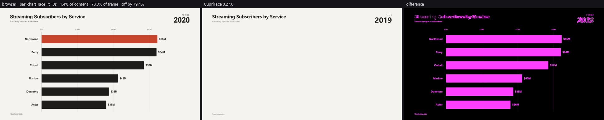

# The comparison harness: how right is a translated block?

One number per block, against a real browser, with the picture that explains it.

```
dotnet run --project harness -- bar-chart-race       # one block
dotnet run --project harness -- --all                # the corpus, and a baseline.json
```

This is the instrument the project is steered by. Progress is **the fraction of the corpus that
renders correctly** — not how many rewrite rules exist, not how many blocks load without an error.
A rewrite rule that is not measured here has not been shown to help.

---

## What it does

1. **Renders the block in a browser**, seeked to N times across its declared duration.
2. **Renders the translated block through CupriFace** at the same times.
3. **Compares the frames** and writes a triptych — browser, engine, difference — for the worst
   sample, or for every sample with `--frames`.

The translation in step 2 is currently the identity: markup through, motion refused by name. That
is deliberate. Milestone 2 exists to produce the number Milestone 3 has to move, and a baseline
flattered by a half-written rewrite rule would be measuring the rule rather than the corpus.

---

## Seeked, not played

A screenshot of a composition that is playing is a screenshot of whenever the screenshot happened.

Every block in the corpus registers a GSAP timeline on `window.__timelines` — measured, 187 of
187, and 183 of them create it already paused — so the reference can be asked for an exact time
rather than raced for one. The four that do not are paused here before being seeked:

```js
tl.pause();
tl.time(t, false);
gsap.globalTimeline.pause();
gsap.globalTimeline.time(t, false);
```

The global timeline is seeked as well as the registered ones, because a bare `gsap.to(...)` never
reaches `window.__timelines`; it plays on the global timeline from page load and would otherwise be
frozen at "however long the page took to load" in every frame.

**The harness provides the host contract these blocks expect.** 162 of the 187 create
`window.__timelines` themselves. The other 25 — every `carousel-*` among them — write
`window.__timelines[DATA.id] = tl` straight into an object they expect their host to have made.
Without it that line throws, no timeline is ever registered, and the block is unmeasurable. So a
one-line `window.__timelines = window.__timelines || {}` is injected before the document's own
scripts run.

`window.__hyperframes` is deliberately **not** stubbed. All 44 blocks that read it guard the access
and fall back to their authored defaults, which is the same content the engine is given; stubbing
it would make the two sides diverge on purpose.

---

## The four numbers, and why there are four

| | |
|---|---|
| **of content** | the share of the pixels the BROWSER paints on that are not visibly wrong. The headline. |
| of frame | the same thing counted over the empty background too. |
| off by | how far the wrong pixels are wrong, as a fraction of full scale, among the wrong ones only. |
| severe | the share of the frame off by more than half of full scale: replaced rather than shifted. |

"Visibly wrong" means any colour channel off by more than 8 of 255. Below that two rasterisers
disagree about the same edge; above it they disagree about the colour. Alpha is ignored, because
both sides are asked for an opaque frame.

### Why not just one

The first version of this harness reported one number, the share of the frame within tolerance,
and it **ranked the corpus backwards**. Two blocks, measured at the same instant:

| | of frame | of content | off by | severe |
|---|---|---|---|---|
| `ai-chat-reveal` | 97.8% | 66.3% | 62.0% | 1.5% |
| `code-typing` | 55.8% | 70.6% | 6.9% | 0.1% |

`ai-chat-reveal` is missing its entire answer paragraph. `code-typing` draws everything and
rasterises its glyphs slightly differently. By the frame-wide share the first looks nearly perfect
and the second looks broken; they are the other way round.

The two measures fail in opposite directions and neither is redundant:

- **of content** fixes the area bias. A 1080×1920 composition that paints on 6% of its area can
  lose a third of its text and still be wrong on 2% of the frame.
- **off by** fixes the magnitude blindness. Half a frame off by 7% and a fiftieth off by 62% are
  different failures, and no share-of-pixels measure can tell them apart.

Content is defined against the reference's own background, taken as its most common colour,
quantised to five bits a channel. Every block in this corpus is a designed composition on a filled
ground, so the dominant colour is the ground. A reference that paints nothing at all - a solid
frame, which several transition blocks open on - has no content to weight by, and falls back to the
frame-wide share rather than declaring itself perfect. That fallback exists because the first
version did declare itself perfect, and a test caught it.

**A block whose reference could not be produced is never scored zero.** It is reported as
unmeasured, by name, with the reason. Unmeasured and wrong are different things, and a zero would
average into the corpus number as though it were a measurement.

### The fifth number, which is not a comparison

`engine ink` is the share of a frame the engine painted, measured against **its own** background
rather than the browser's frame. It is the only line in the report that does not involve the
browser at all, and it exists because every comparison confuses two failures that need completely
different work:

| | of content | ink |
|---|---|---|
| drew the wrong thing | bad | high |
| drew nothing | bad | ~0 |

The run prints `engine blank`: the blocks painting under 0.5% of their own frame. Those blocks
cannot be improved by any amount of fidelity work — not a typeface, not an easing curve, not a
colour — and without this line nothing in the report said which ones they were. It was added after
the third correct fix in a row moved the corpus mean by zero; see **The baseline** below.

---

## The baseline

The first corpus-wide run. **CupriFace 0.26.1, Edg/153.0.4234.32, Windows, 5 samples per block,
187 blocks in 5 minutes 46 seconds.**

| | |
|---|---|
| scored | **150** |
| unmeasured | **37** |
| mean matching | **61.6%** |
| median | 79.2% |
| **mean matching, over the 125 blocks whose reference actually moves** | **55.2%** — frame-wide, the measure in use at the time |
| blocks where the engine rendered the same frame at every time | **150 of 150** |

```
90-100%   52 blocks
 70-90%   30
 40-70%   22
 10-40%   17
  0-10%   29
```

**Not one block animated.** That is the expected result and the point of measuring it: there is no
compiler yet, so the engine renders a still of whatever the markup says before any timeline touches
it, and 150 of 150 confirm it rather than assume it.

**Twenty-five of the 150 have a reference that barely moves** — under 1% of pixels change across
the whole composition — so their scores are not evidence of anything. `editorial-flash-overlay` is
the extreme: it scores **100%**, and its reference does not change by a single pixel. The two
renderers agree about a still. That is why the corpus number worth quoting is the one over blocks
whose reference actually moves.

### The 37 that could not be scored

| | |
|---|---|
| **35** | the engine threw on the document — the `border` shorthand crash, below |
| 1 | `vfx-iphone-device`: never became ready in the browser |
| 1 | `vfx-shatter`: the block's own script throws — `ctxA.drawElementImage is not a function` |

The last one is worth keeping: the block is broken in a browser too, so there is no reference to be
had and nothing for a translator to fix.

### What it read after the compiler

Same harness, same engine, same browser, with [the GSAP compiler](COMPILER.md) in the seam:

| | baseline | with the compiler |
|---|---|---|
| scored | 150 | **183** |
| unmeasured | 37 | **4** |
| mean matching | 61.6% | 67.1% |
| **over blocks whose reference moves** | **55.2%** | **62.8%** |
| (both frame-wide; the content measure came later and reads 38.1%) | | |
| engine rendered one still frame | **150 of 150** | 145 of 183 |

### What the ink measure said, and why it is the last word here

**CupriFace 0.28.1, 185 blocks scored:**

| | |
|---|---|
| mean of content | 38.2% |
| engine paints | 11.3% of the frame |
| browser paints | 23.8% of the frame |
| **blocks painting under 0.5% of their own frame** | **93 of 185** |

Half the corpus draws essentially nothing. Not wrongly — nothing. Those blocks build or paint their
composition from JavaScript, and the translation removes it, so what reaches the engine is a page
with the content still to be made. No amount of work on colour, easing, timing or typography can
move them.

It took three correct fixes scoring zero to justify measuring this. A timeline cursor that a
refusal had stopped advancing; an ease parameter that 44 blocks write and none of which was being
read; and a WOFF 2 decoder that removed a font refusal from 157 blocks. Measured one at a time
against the same corpus, each moved the mean by less than a tenth of a point, and the font fix
changed the rendered pixels of **3 of 185 blocks** — because the blocks that carry a typeface are
mostly the blocks that draw no text.

Three of the four blocks still unmeasured are the same engine crash in a form the rewrite does not
reach and a block whose own script throws in a browser. The one number that did **not** move the
way it looks: the mean over moving blocks is not a like-for-like comparison, because 33 blocks that
previously could not be loaded at all are now in the population, and they score below average.

---

## Reading a triptych



Left is the browser at that instant, middle is CupriFace, right is where they differ — magenta,
amplified three times because the differences that matter are often a few levels of grey across a
whole title, and an unamplified diff of those is a black rectangle.

They are only meaningful together. An engine frame alone looks plausible; it is the panel beside it
that shows the bars never grew.

---

## What it is careful about

**Fonts.** The engine is given CupriCut's shipped faces when that repository is beside this one. A
document with no registered face is at the mercy of whatever the machine has installed, which makes
a text-heavy corpus score differently on two machines for no engine reason.

**Subpixel antialiasing.** The browser runs with `--disable-lcd-text`. Windows fringes text with
colour the engine never draws, and it would have been counted as a difference on every letter of
every block.

**Scrollbars, GPU, device scale.** Hidden, disabled, pinned to 1. A scrollbar is fifteen pixels of
pure difference; a GPU raster is one machine's answer rather than a reference.

**The page it is actually looking at.** After a navigate, `document.readyState` describes the
*previous* block for a moment — it polls green immediately and would be screenshotted five times.
The harness waits for the href it asked for, plus fonts loaded and images complete.

**Relative asset paths.** A browser resolves `assets/logo.png` against the document's location;
`CupriDocument.Load` is handed a string, which has no location. The harness makes those absolute
before the engine sees them. Not a rewrite rule — restoring what reading a file into a string took
away. Without it, twenty-three blocks would be scored against a reference that has its images while
the engine's copy does not.

---

## What the first run found

Two things worth knowing before reading any score, both found by running rather than by reading.

**An engine crash on ordinary CSS, costing 35 of the 187 blocks.** *(As diagnosed on the first
run. Two more parsers reach the same fault, and one of them survives the obvious fix - see
[COMPILER.md](COMPILER.md).)* `border: 1px solid rgba(198, 173, 144, 0.32)` throws
`ArgumentOutOfRangeException: length ('-6')` out of `Colors.TryParse`. The shorthand parser splits
the value on spaces and offers each token to the colour parser, so `rgba(198,` arrives with an open
parenthesis and no close, and `text[(IndexOf('(') + 1)..IndexOf(')')]` becomes `[5..-1]`. It
reaches blocks that never write `rgba` beside `border` at all: `beat-freeze-cut` writes
`border: 1px solid var(--bfc-line)`, and that custom property holds a spaced `rgba()`. Two blocks
cannot be loaded at all because of it. Pinned by `EngineBugTests`, which will fail when it is
fixed — which is the point. The longhand `border-color` takes the same value without complaint.

**Declared duration and timeline duration disagree, in a third of the corpus.** 50 of the 150
scored blocks declare a `data-duration` more than a quarter of a second away from what their GSAP
timeline actually spans — `bar-chart-race` declares 12 seconds against a timeline of 10, so a sixth
of its reference is a still frame. The harness samples the declared duration, because that is what
a renderer would use, records the timeline's own span beside it, and says so when they disagree.
The compiler will have to decide which one a translated composition keeps.

---

## Running it

```
dotnet run --project harness -- <block>     score one block
dotnet run --project harness -- --all       score the corpus

  --samples N    times across the declared duration (default 5)
  --out DIR      where frames and baseline.json go (default harness/out)
  --frames       keep every sample's images, not only the worst
  --limit N      stop after N blocks, for a quick look
```

Needs the corpus (`python tools/fetch-corpus.py`), a browser — Edge or Chrome, or
`CUPRILEX_BROWSER` pointing at one — and the network, because every block loads GSAP from a CDN.

`harness/out/` is ignored by git. `baseline.json` holds every block's score and the engine, browser
and platform that produced it; `blocks.jsonl` is appended as the run goes, so a process that dies
at block 150 does not cost the 149 measurements before it.
